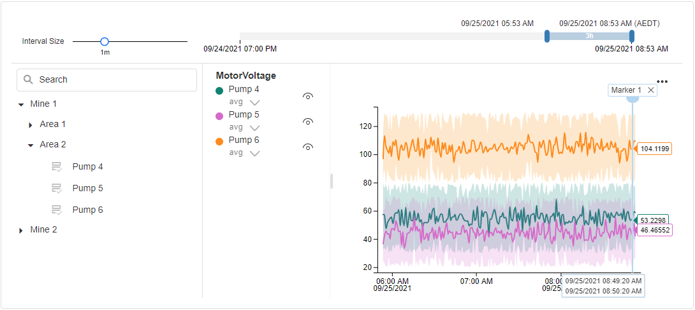
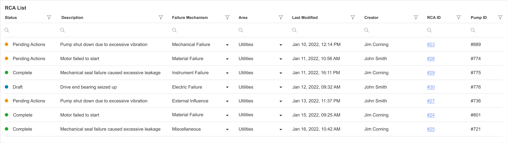
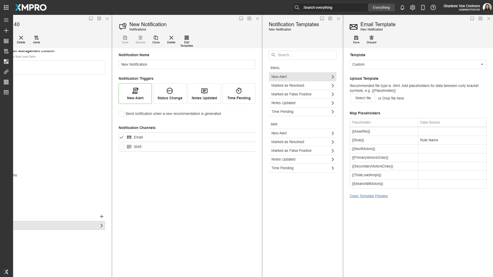
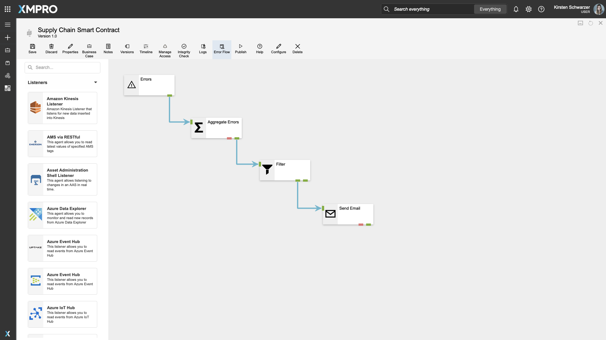

# What's New in 4.1

## Overview

This page shows a curated selection of features we’ve released in XMPro version 4.1. For more details on what's in the latest version, please read the [Release Notes](../../release-notes/archived/v4.1.0.md).&#x20;

## App Designer

### Time Series Chart Block

<figure><figcaption>
Time Series Chart Block
</figcaption></figure>

This new block in the App Designer toolbox allows you to visualize large amounts of time series data to give your engineers and operators a real-time view of your asset health.&#x20;

You can use a variety of data sources to populate your Time Series Chart, but a key benefit is that the asset hierarchy can be integrated with Azure Digital Twins and the telemetry data can be loaded from Azure Data Explorer.

Useful features built into the Time Series Chart block include the ability to drop markers on the chart to denote important events, as well as panning and zooming to change the timescale. You can show or hide assets and parameters via the hierarchy panel. This visualization makes it easy to compare different assets with each other across multiple parameters, like temperature, pressure and vibration.&#x20;

### Grid Block

<figure><figcaption>
Grids with indicators, select boxes and hyperlinks
</figcaption></figure>

We’ve expanded the functionality of the Grid Block in the App Designer toolbox to include visual indicators, which allow you to show the state of an item in the grid. This is particularly useful if you want to use colours to indicate the health of an asset or the status of a root cause analysis.

There are also new column options for select boxes and hyperlinks, making it easier to choose from a predefined list or navigate to a subpage from the grid.&#x20;

You can set default filters to automatically organize your grid data when you load the page. And we’ve added support for column reordering, resizing and state persistence.

### **Notification Templates**

<figure><figcaption>
Notification Templates
</figcaption></figure>

XMPro Recommendations allow you to send automated email and SMS notifications to inform your team about a critical event occurring in your data. You can now create custom templates for those notifications simply by uploading an HTML file for email or adding your text message for SMS.&#x20;

Placeholders in your templates enable you to replace static text in your notifications with real-time data about the recommendation alert like its title, how long it has been pending, and the real-time data that triggered the alert.

## Data Stream Designer

### **Stream Metrics**

<figure><figcaption>
Stream Metrics
</figcaption></figure>

We’ve added Stream Metrics to Data Streams to give you more visibility into the health of your Data Streams.&#x20;

Once a Data Stream is published, you will be able to see how much data is being processed per minute as well as how many errors were generated by Agents in the Stream. You’ll also have better visibility into how many of your Stream Hosts are online.

### **Error Flow**

<figure><figcaption>
Error Flow
</figcaption></figure>

How do you know when your Data Stream health is deteriorating? With the new Error Flow feature you can create a separate set of actions that trigger when your Data Stream encounters errors.&#x20;

For example, the Data Stream can send out an email to notify you if the issues if there are more than a certain number of errors occurring per minute.

### **Connector Documentation**

We’ve made major updates to our [documentation](https://documentation.xmpro.com/resources/integrations) for the growing XMPro connector library. Our team has added more example videos and GIFs to help you confidently configure agents on your own.

## **Platform Security**

As part of our continuous commitment to security, we’ve implemented quarterly scans of our platform. Veracode scans the software and tests it in multiple ways, including using Static Analysis (white-box testing), Dynamic Analysis (black-box testing), and Software Composition Analysis.&#x20;

The results and reports from the testing are available for review [here](../platform-security.md).
